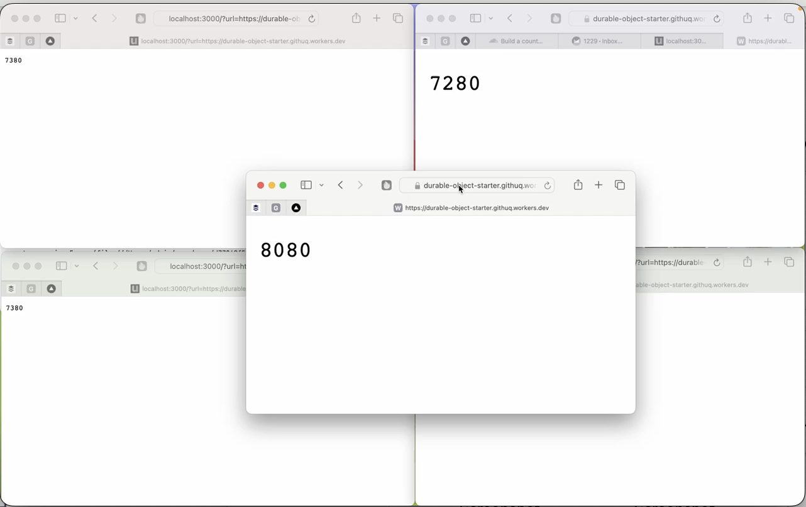

This worker demonstrates the capability of durable objects to share promises.

Suppose we have [this URL](https://durable-object-starter.githuq.workers.dev) where a counter increases every time you fetch it: https://durable-object-starter.githuq.workers.dev

Now suppose this URL costs us $1.00 every time we call it. We better not call it too often then!

Cloudflare Durable Objects to the rescue. In this simple example, the fetch Response Promise is saved to the durable object, and reused across parallel worker calls, so the URL only gets called once, even if 100 users request it at the same time.

